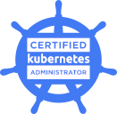

## Hey there, I am Shailesh Vaidya 👋 

I'm a DevOps Architect with a passion for designing and implementing enterprise-level DevOps solutions. I specialize in cloud computing, containerization, automation, and CI/CD pipelines, and have worked with several organizations to help them streamline their software development and delivery processes.

## Technologies

## Certifications

## GitHub Stats

## Contact Me
If you're interested in discussing DevOps, cloud computing, or anything else related to software development and delivery, please feel free to reach out to me on LinkedIn or via email. I'd love to connect with you!

